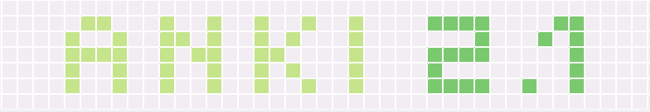
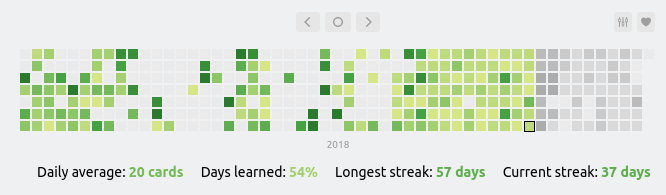
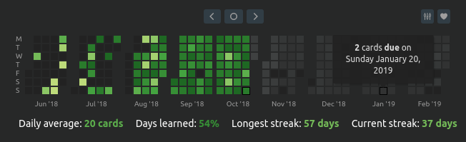

# Changelog

All notable changes to [Review Heatmap](https://ankiweb.net/shared/info/1771074083) will be documented here. You can click on each release number to be directed to a detailed log of all code commits for that particular release. The download links will direct you to the GitHub release page, allowing you to manually install a release if you want.

If you enjoy Review Heatmap, please consider supporting my work on Patreon, or by buying me a cup of coffee :coffee::

 

&nbsp;

:heart: My heartfelt thanks goes out to everyone who has supported this add-on through their tips, contributions, or any other means (you know who you are!). All of the recent additions would not have been possible without you. Thank you for being awesome!

## [0.7.0-beta.1] - 2018-10-28

### [Download](https://github.com/glutanimate/review-heatmap/releases/tag/0.7.0-beta.1)

### Added

- Full **Anki 2.1 support** (and 2.0 backwards compatibility)
    - Yes, it's finally here!
- **Completely reworked months mode**
    - shows a **continuous timeline** of activity, instead of being bound to a yearly schedule
    - more **granular insight** into monthly activity, and activity by weekday
- A **multitude of new options**, granting you more control over your stats than ever before:
    - the ability to set a **starting date** for the heatmap
    - the ability to **exclude certain decks** from being tracked
    - an option to **exclude deleted cards** from your stats
    - the ability to set a custom hotkey to toggle the heatmap
- **Secondary actions** when **Shift-clicking** heatmap **buttons**:
    - quickly move to the very beginning of your review history
    - quickly move to the last scheduled review
    - instantly change the display mode or color theme
    - and more!
- **Support** for the **[Night Mode](https://ankiweb.net/shared/info/1496166067) add-on**
    - all **themes** now come with beautiful **night mode versions** that are automatically switched on when Night Mode is active (requires Night Mode version 2.2.3 and up)
    - special thanks to [Michał Krassowski](https://github.com/krassowski) for laying the groundwork on Night Mode's side!
- A **beautiful new UI** with updated buttons, new tooltips, and more polish than ever before

### Changed

- **Completely rewrote** the add-on. Review Heatmap's codebase hadn't really changed that much since the add-on' first release nearly two years ago. This rewrite, although arduous and very time-consuming, was long overdue and now provides a stable and maintainable base for future additions to Review Heatmap.
- Fully **redesigned options dialog**, which can now also be accessed directly from the heatmap.
- On Anki 2.1 the heatmap now loads asynchronously, i.e. without blocking page load, which should make for faster switching between Anki's screens even with long review histories
- History and forecast limits are now inactive by default. The previous default of limiting the displayed data to a period of 365 days could be confusing sometimes.

### Fixed

- Fixed a series of elusive bugs surrounding different time-zones, daily cutoff settings, and other date mismatches (#23)
- Fixed incompatibilities with the Night Mode add-on (#9)
- Fixed view scrolling sometimes not working (#16)
- Fixes some macOS- and Windows-specific layout and sizing issues
- Quite a few other smaller issues which would take too long to list here

### Deprecated

- the `seen:` query phrase has been superseded by the new `rid:` phrase, and is likely to be removed in the future

### Other

- Throughout the redesign of Review Heatmap I had to develop a completely new set new tools for building and testing my add-ons. The fruits of this work will also benefit my other projects, making for a faster iteration time, and more 2.1 add-on releases coming soon!
- Review Heatmap and all of the other add-ons I'm working on are now tested against all platforms supported by Anki. If you are a macOS or Windows user you should see a lot of improvements in ironing out platform-specific kinks in the future.

## [0.6.1-alpha-anki21] - 2018-09-23

### [Download](https://github.com/glutanimate/review-heatmap/releases/tag/0.6.1-anki21-alpha)

### Added

- cursory Anki 2.1 support

### Fixed

- A number of smaller bug fixes and improvements

## [0.6.0] - 2017-02-19
### Note

**Important**: As this version uses a new file structure you will have to remove older versions of the add-on before installing it.

### Added
- Toggle heatmap display on the deck browser and overview pages by using CTRL + R

### Changed
- New modularized add-on structure which should make maintenance easier

## [0.5.2] - 2017-01-15
### Fixed
- Fix review count tooltips for counts over 999 (#3)

## [0.5.1] - 2017-01-11
### Fixed
- Fix an error in the calculation of "days learned" (thanks to David Bailey!)

## [0.5.0] - 2017-01-10
### Added
- Stats on average review counts and days learned, each graded with a custom color scale
- Customizable calendar modes - display the days as a continuous year, or split them up into months
- Customizable color schemes - choose between 5 different color palettes
- You can now decide where the heatmap will appear
- All of the above and all other settings can now be contolled through an options menu
- The heatmap will also appear in the stats window now. This one is unaffacted by any limits and follows the interval settings set in the stats window.

### Changed

- Limit heatmap data range to 365 days for past reviews and 90 for pending reviews by default. This should improve performance on lower-end machines. These limits can be lifted in the options menu.

### Fixed

- Fix negative pending review counts (thanks to David Bailey!)

## 0.2.0 - 2017-01-01
### Changed
- Switched to relative scaling and scoring of user activity

## 0.1.0 - 2016-12-31

First release of Review Heatmap.

[Unreleased]: https://github.com/glutanimate/review-heatmap/compare/v0.7.0-beta1...HEAD
[0.7.0-beta.1]: https://github.com/glutanimate/review-heatmap/compare/v0.6.1-anki21-alpha...v0.7.0-beta1
[0.6.1-alpha-anki21]: https://github.com/glutanimate/review-heatmap/compare/v0.6.0...0.6.1-alpha-anki21
[0.6.0]: https://github.com/glutanimate/review-heatmap/compare/v0.5.2...v0.6.0
[0.5.2]: https://github.com/glutanimate/review-heatmap/compare/v0.5.1...v0.5.2
[0.5.1]: https://github.com/glutanimate/review-heatmap/compare/39f686fd8dbfe532e97ff9c4a8189a684a011492...v0.5.1
[0.5.0]: https://github.com/glutanimate/review-heatmap/compare/22fcaa60d71967a453473de0b1f1fe970438ad08...v0.5.0

-----

The format of this file is based on [Keep a Changelog](https://keepachangelog.com/en/1.0.0/),
and this project adheres to [Semantic Versioning](https://semver.org/spec/v2.0.0.html).