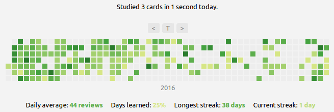
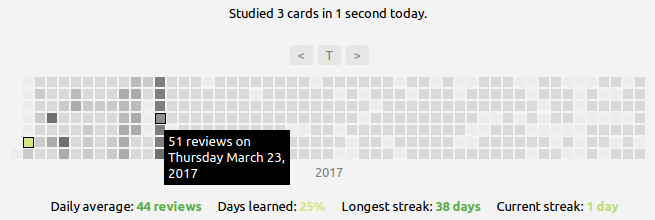

## Review Heatmap for Anki

Adds a **heatmap graph** to [Anki](https://apps.ankiweb.net/)'s main window which visualizes past and future card review activity, similar to the contribution view on GitHub. Information on the **current streak** is displayed alongside the heatmap. Clicking on an item shows the cards reviewed on that day.

<!-- MarkdownTOC -->

- [Screenshots](#screenshots)
- [Video Demonstration](#video-demonstration)
- [Documentation](#documentation)
- [Credits and License](#credits-and-license)

<!-- /MarkdownTOC -->

### Screenshots

### Video Demonstration

*General overview*

*Customization*

(Make sure to enable closed-captions for comments on the demonstrated features)

### Documentation

The installation and use of the add-on is documented in the [Wiki section](https://github.com/Glutanimate/review-heatmap/wiki) and a [series of video tutorials on YouTube](https://www.youtube.com/playlist?list=PL3MozITKTz5Y9owI163AJMYqKwhFrTKcT). More information may also be found in the [AnkiWeb description](docs/description.md).

### Credits and License

*Review Heatmap* is *Copyright © 2016-2018 [Aristotelis P.](https://glutanimate.com)*

Inspired by GitHub's contribution calendar and *Forecast graph on Overview page* by Steve AW.

Ships with the following javascript libraries:

- d3.js (v3.5.17), (c) Mike Bostock, BSD license
- cal-heatmap (v3.6.2), (c) Wan Qi Chen, MIT license

Licensed under the [GNU AGPL v3](https://www.gnu.org/licenses/agpl.html).
